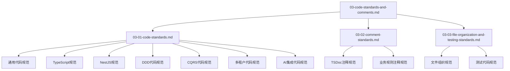

# Aiofix-AI-SaaS 平台代码规范与注释规范

## 概述

本文档基于Core模块设计方案，为Aiofix-AI-SaaS平台制定统一的代码规范和注释规范。这些规范确保代码质量、可维护性和团队协作效率，同时支持AI原生企业级应用的开发需求。

## 文档拆分说明

由于原文档篇幅较长，为了提高可读性和维护性，现已拆分为以下3份独立文档：

### 📋 **文档列表**

1. **[代码规范](./03-01-code-standards.md)** - 通用代码规范、TypeScript规范、NestJS规范、DDD代码规范、CQRS代码规范、多租户代码规范、AI集成代码规范
2. **[注释规范](./03-02-comment-standards.md)** - TSDoc注释规范、业务规则注释规范
3. **[文件组织与测试代码规范](./03-03-file-organization-and-testing-standards.md)** - 文件组织规范、测试代码规范

### 🎯 **使用建议**

- **开发人员**：建议按顺序阅读所有文档，建立完整的规范认知
- **代码审查**：在代码审查时参考相应的规范文档
- **新人培训**：可以作为新人培训的标准化教材
- **规范更新**：当需要更新规范时，请同时更新相关文档

### 📚 **文档关系**



---

## 快速导航

### 🚀 **开始使用**

如果您是第一次接触这些规范，建议按以下顺序阅读：

1. **首先阅读**：[代码规范](./03-01-code-standards.md) - 了解基础的代码编写规范
2. **然后阅读**：[注释规范](./03-02-comment-standards.md) - 学习如何编写高质量的注释
3. **最后阅读**：[文件组织与测试代码规范](./03-03-file-organization-and-testing-standards.md) - 掌握项目组织和测试规范

### 📖 **按需查阅**

如果您需要查找特定内容，可以直接访问相应的文档：

- **代码编写问题** → [代码规范](./03-01-code-standards.md)
- **注释编写问题** → [注释规范](./03-02-comment-standards.md)
- **文件组织问题** → [文件组织与测试代码规范](./03-03-file-organization-and-testing-standards.md)

---

## 原文档内容

> **注意**：以下内容为原文档的完整内容，仅供参考。建议使用拆分后的独立文档。

## 设计原则

### 核心原则

1. **一致性**：所有代码遵循统一的命名、结构和风格规范
2. **可读性**：代码和注释清晰易懂，便于团队协作
3. **可维护性**：代码结构清晰，便于扩展和修改
4. **类型安全**：充分利用TypeScript的类型系统
5. **AI原生**：代码设计支持AI能力的深度集成
6. **企业级**：支持多租户、多组织、多部门的企业级特性

### 技术原则

- **DDD驱动**：遵循领域驱动设计原则
- **Clean Architecture**：遵循清洁架构分层原则
- **CQRS模式**：命令查询分离，事件驱动
- **依赖倒置**：通过接口和抽象类实现依赖倒置
- **单一职责**：每个类和方法职责单一明确

## 目录结构

1. [通用代码规范](#通用代码规范)
2. [TypeScript规范](#typescript规范)
3. [NestJS规范](#nestjs规范)
4. [DDD代码规范](#ddd代码规范)
5. [CQRS代码规范](#cqrs代码规范)
6. [多租户代码规范](#多租户代码规范)
7. [AI集成代码规范](#ai集成代码规范)
8. [注释规范](#注释规范)
9. [文件组织规范](#文件组织规范)
10. [测试代码规范](#测试代码规范)

---

## 通用代码规范

### 命名规范

#### 文件命名

```typescript
// ✅ 正确：使用kebab-case
user-profile.entity.ts
create-user.command.ts
user-created.event.ts
user-repository.interface.ts

// ❌ 错误：使用camelCase或PascalCase
userProfile.entity.ts
CreateUser.command.ts
UserCreated.event.ts
```

#### 类命名

```typescript
// ✅ 正确：使用PascalCase
export class UserProfile extends TenantAwareEntity {}
export class CreateUserCommand extends TenantCommand {}
export class UserCreatedEvent extends TenantEvent {}
export class UserRepository extends TenantEntityRepository<User> {}

// ❌ 错误：使用camelCase
export class userProfile extends TenantAwareEntity {}
export class createUserCommand extends TenantCommand {}
```

#### 接口命名

```typescript
// ✅ 正确：使用I前缀 + PascalCase
export interface IUserRepository {}
export interface IAIService {}
export interface ITenantContext {}

// ❌ 错误：不使用I前缀
export interface UserRepository {}
export interface AIService {}
```

#### 方法命名

```typescript
// ✅ 正确：使用camelCase，动词开头
export class UserService {
  async createUser(command: CreateUserCommand): Promise<User> {}
  async updateUserProfile(id: EntityId, data: UpdateUserProfileDto): Promise<void> {}
  async softDeleteUser(id: EntityId, deletedBy: UserId): Promise<void> {}
  async restoreUser(id: EntityId, restoredBy: UserId): Promise<void> {}
  
  // 查询方法使用get/find前缀
  async getUserById(id: EntityId): Promise<User | null> {}
  async findUsersByTenant(tenantId: TenantId): Promise<User[]> {}
  async getActiveUsers(): Promise<User[]> {}
}

// ❌ 错误：使用名词或不清楚的动词
export class UserService {
  async user(command: CreateUserCommand): Promise<User> {}
  async userProfile(id: EntityId, data: UpdateUserProfileDto): Promise<void> {}
  async delete(id: EntityId): Promise<void> {} // 不清楚是软删除还是硬删除
}
```

#### 变量命名

```typescript
// ✅ 正确：使用camelCase，语义清晰
const userId = EntityId.generate();
const tenantId = TenantId.fromString('tenant-123');
const userProfile = await this.userRepository.findById(userId);
const isActive = user.status === UserStatus.ACTIVE;
const hasPermission = await this.permissionService.checkPermission(userId, 'user.create');

// ❌ 错误：使用缩写或不清晰的命名
const uid = EntityId.generate();
const tid = TenantId.fromString('tenant-123');
const up = await this.userRepository.findById(uid);
const flag = user.status === UserStatus.ACTIVE;
```

#### 常量命名

```typescript
// ✅ 正确：使用UPPER_SNAKE_CASE
export const DEFAULT_PAGE_SIZE = 10;
export const MAX_RETRY_ATTEMPTS = 3;
export const AI_MODEL_TIMEOUT = 30000;
export const TENANT_QUOTA_LIMIT = 1000;

// ❌ 错误：使用camelCase
export const defaultPageSize = 10;
export const maxRetryAttempts = 3;
```

### 代码结构规范

#### 导入顺序

```typescript
// ✅ 正确：按以下顺序组织导入
// 1. Node.js内置模块
import { EventEmitter } from 'events';

// 2. 第三方库
import { Injectable, Logger } from '@nestjs/common';
import { EntityManager } from '@mikro-orm/core';

// 3. 项目内部模块（按路径深度排序）
import { EntityId, TenantId, UserId } from '@aiofix-ai-saas-practice/core';
import { User } from '../domain/entities/user.entity';
import { CreateUserCommand } from '../application/commands/create-user.command';
import { UserRepository } from '../infrastructure/repositories/user.repository';

// 4. 相对路径导入
import { UserService } from './user.service';
import { UserDto } from './dto/user.dto';
```

#### 类成员顺序

```typescript
// ✅ 正确：按以下顺序组织类成员
export class UserService {
  // 1. 静态属性
  private static readonly DEFAULT_PAGE_SIZE = 10;
  
  // 2. 实例属性
  private readonly logger = new Logger(UserService.name);
  
  // 3. 构造函数
  constructor(
    private readonly userRepository: IUserRepository,
    private readonly eventBus: IEventBus,
    private readonly aiService: IAIService
  ) {}
  
  // 4. 公共方法
  async createUser(command: CreateUserCommand): Promise<User> {
    // 实现
  }
  
  // 5. 私有方法
  private async validateUserData(data: CreateUserDto): Promise<void> {
    // 实现
  }
  
  // 6. 受保护方法
  protected async handleUserCreated(event: UserCreatedEvent): Promise<void> {
    // 实现
  }
}
```

#### 方法参数顺序

```typescript
// ✅ 正确：参数按重要性排序
export class UserService {
  // 1. 标识符参数（ID、Key等）
  // 2. 业务数据参数
  // 3. 配置参数
  // 4. 可选参数
  async updateUser(
    userId: EntityId,           // 标识符
    tenantId: TenantId,         // 租户上下文
    updateData: UpdateUserDto,  // 业务数据
    updatedBy: UserId,          // 操作者
    options?: UpdateOptions     // 可选配置
  ): Promise<User> {
    // 实现
  }
}
```

### 错误处理规范

#### 异常类型

```typescript
// ✅ 正确：使用具体的异常类型
export class UserNotFoundError extends Error {
  constructor(userId: string) {
    super(`User with ID ${userId} not found`);
    this.name = 'UserNotFoundError';
  }
}

export class InvalidTenantAccessError extends Error {
  constructor(tenantId: string) {
    super(`Access denied for tenant ${tenantId}`);
    this.name = 'InvalidTenantAccessError';
  }
}

export class AIQuotaExceededError extends Error {
  constructor(tenantId: string, quota: number) {
    super(`AI quota exceeded for tenant ${tenantId}. Limit: ${quota}`);
    this.name = 'AIQuotaExceededError';
  }
}
```

#### 异常处理

```typescript
// ✅ 正确：适当的异常处理
export class UserService {
  async getUserById(id: EntityId, tenantId: TenantId): Promise<User> {
    try {
      const user = await this.userRepository.findByTenantAndId(id, tenantId);
      if (!user) {
        throw new UserNotFoundError(id.toString());
      }
      return user;
    } catch (error) {
      if (error instanceof UserNotFoundError) {
        throw error; // 重新抛出业务异常
      }
      this.logger.error(`Failed to get user ${id.toString()}`, error);
      throw new InternalServerError('Failed to retrieve user');
    }
  }
}
```

---

## TypeScript规范

### 类型定义规范

#### 基础类型

```typescript
// ✅ 正确：使用明确的类型定义
interface CreateUserDto {
  readonly name: string;
  readonly email: string;
  readonly tenantId: string;
  readonly organizationId?: string;
  readonly departmentId?: string;
}

// ✅ 正确：使用联合类型
type UserStatus = 'ACTIVE' | 'INACTIVE' | 'SUSPENDED' | 'DELETED';

// ✅ 正确：使用枚举
enum UserRole {
  ADMIN = 'admin',
  MANAGER = 'manager',
  USER = 'user',
  GUEST = 'guest'
}

// ❌ 错误：使用any类型
interface CreateUserDto {
  name: any;
  email: any;
  data: any;
}
```

#### 泛型使用

```typescript
// ✅ 正确：使用有意义的泛型参数名
interface IRepository<TEntity, TId = string> {
  findById(id: TId): Promise<TEntity | null>;
  save(entity: TEntity): Promise<void>;
  delete(id: TId): Promise<void>;
}

// ✅ 正确：约束泛型类型
interface ICommandHandler<TCommand extends Command, TResult> {
  execute(command: TCommand): Promise<TResult>;
}

// ❌ 错误：使用无意义的泛型参数名
interface IRepository<T, U> {
  findById(id: U): Promise<T | null>;
}
```

#### 类型守卫

```typescript
// ✅ 正确：使用类型守卫
function isUser(entity: BaseEntity): entity is User {
  return entity instanceof User;
}

function isTenantAware(entity: BaseEntity): entity is TenantAwareEntity {
  return 'tenantId' in entity;
}

// 使用类型守卫
if (isUser(entity)) {
  // TypeScript知道entity是User类型
  entity.updateProfile(name, email);
}
```

### 接口设计规范

#### 接口定义

```typescript
// ✅ 正确：接口职责单一，命名清晰
interface IUserRepository {
  findById(id: EntityId): Promise<User | null>;
  findByTenant(tenantId: TenantId): Promise<User[]>;
  save(user: User): Promise<void>;
  delete(id: EntityId): Promise<void>;
}

interface IUserService {
  createUser(command: CreateUserCommand): Promise<User>;
  updateUser(command: UpdateUserCommand): Promise<User>;
  deleteUser(command: DeleteUserCommand): Promise<void>;
}

// ❌ 错误：接口职责过多
interface IUserManager {
  // 包含了仓储、服务、事件处理等多种职责
  findById(id: EntityId): Promise<User | null>;
  createUser(command: CreateUserCommand): Promise<User>;
  publishEvent(event: DomainEvent): Promise<void>;
  validatePermission(userId: EntityId, permission: string): Promise<boolean>;
}
```

#### 可选属性

```typescript
// ✅ 正确：明确标记可选属性
interface UpdateUserDto {
  readonly name?: string;
  readonly email?: string;
  readonly avatar?: string;
  readonly status?: UserStatus;
  readonly organizationId?: OrganizationId;
  readonly departmentId?: EntityId;
}

// ✅ 正确：使用Partial工具类型
type CreateUserDto = Partial<UpdateUserDto> & {
  readonly name: string; // 必需属性
  readonly email: string; // 必需属性
};
```

---

## NestJS规范

### 装饰器使用规范

#### 依赖注入

```typescript
// ✅ 正确：使用@Injectable装饰器
@Injectable()
export class UserService {
  constructor(
    private readonly userRepository: IUserRepository,
    private readonly eventBus: IEventBus,
    private readonly logger: Logger
  ) {}
}

// ✅ 正确：使用@Inject装饰器注入接口
@Injectable()
export class UserService {
  constructor(
    @Inject('IUserRepository') private readonly userRepository: IUserRepository,
    @Inject('IEventBus') private readonly eventBus: IEventBus
  ) {}
}
```

#### 控制器规范

```typescript
// ✅ 正确：控制器结构清晰
@Controller('users')
@UseGuards(TenantGuard, PermissionGuard)
export class UserController extends TenantController {
  constructor(
    private readonly commandBus: CommandBus,
    private readonly queryBus: QueryBus,
    private readonly userService: UserService
  ) {
    super(commandBus, queryBus);
  }

  @Post()
  @RequirePermission('user.create')
  @ApiOperation({ summary: '创建用户' })
  @ApiResponse({ status: 201, description: '用户创建成功' })
  async createUser(
    @Body() dto: CreateUserDto,
    @Req() req: Request
  ): Promise<UserResponseDto> {
    const command = new CreateUserCommand(
      this.extractTenantId(req),
      this.extractUserId(req),
      dto
    );
    
    const user = await this.executeCommand(command);
    return UserResponseDto.fromEntity(user);
  }

  @Get(':id')
  @RequirePermission('user.read')
  @ApiOperation({ summary: '获取用户信息' })
  async getUser(
    @Param('id') id: string,
    @Req() req: Request
  ): Promise<UserResponseDto> {
    const query = new GetUserQuery(
      this.extractTenantId(req),
      this.extractUserId(req),
      EntityId.fromString(id)
    );
    
    const user = await this.executeQuery(query);
    return UserResponseDto.fromEntity(user);
  }
}
```

#### 模块组织

```typescript
// ✅ 正确：模块结构清晰
@Module({
  imports: [
    CoreModule.forRoot({
      cqrs: {
        enableEventSourcing: true,
        enableMultiTenancy: true,
      },
    }),
    UserModule,
  ],
  controllers: [UserController],
  providers: [
    UserService,
    {
      provide: 'IUserRepository',
      useClass: UserRepository,
    },
    {
      provide: 'IEventBus',
      useClass: EventBus,
    },
  ],
  exports: [UserService],
})
export class UserModule {}
```

---

## DDD代码规范

### 实体设计规范

#### 基础实体

```typescript
// ✅ 正确：实体设计遵循DDD原则
@Entity()
export class UserProfile extends TenantAwareEntity {
  @Property()
  private name: string;

  @Property()
  private email: string;

  @Property()
  private avatar: string;

  @Property()
  private status: UserStatus;

  constructor(
    tenantId: TenantId,
    name: string,
    email: string,
    createdBy: UserId
  ) {
    super(tenantId, createdBy);
    this.name = name;
    this.email = email;
    this.avatar = '';
    this.status = UserStatus.ACTIVE;
  }

  // 业务方法
  updateProfile(name: string, email: string, updatedBy: UserId): void {
    this.validateActive();
    this.name = name;
    this.email = email;
    this.updateVersion(updatedBy);
  }

  updateAvatar(avatar: string, updatedBy: UserId): void {
    this.validateActive();
    this.avatar = avatar;
    this.updateVersion(updatedBy);
  }

  activate(activatedBy: UserId): void {
    if (this.status === UserStatus.ACTIVE) {
      throw new UserAlreadyActiveError(this.id.toString());
    }
    this.status = UserStatus.ACTIVE;
    this.updateVersion(activatedBy);
  }

  deactivate(deactivatedBy: UserId, reason?: string): void {
    this.validateActive();
    this.status = UserStatus.INACTIVE;
    this.updateVersion(deactivatedBy);
  }

  // 私有方法
  private validateActive(): void {
    if (this.status !== UserStatus.ACTIVE) {
      throw new UserNotActiveError(this.id.toString());
    }
  }

  // 访问器
  getName(): string {
    return this.name;
  }

  getEmail(): string {
    return this.email;
  }

  getStatus(): UserStatus {
    return this.status;
  }
}
```

#### 聚合根设计

```typescript
// ✅ 正确：聚合根设计
export class User extends TenantAwareAggregateRoot {
  private name: string;
  private email: string;
  private status: UserStatus;
  private roles: string[];
  private profile: UserProfile;

  constructor(
    id: EntityId,
    tenantId: TenantId,
    name: string,
    email: string,
    createdBy: UserId
  ) {
    super(id, tenantId);
    this.name = name;
    this.email = email;
    this.status = UserStatus.ACTIVE;
    this.roles = [];
    
    // 发布领域事件
    this.addEvent(new UserCreatedEvent(
      id,
      tenantId,
      name,
      email,
      createdBy
    ));
  }

  // 业务方法
  updateName(newName: string, updatedBy: UserId): void {
    if (this.name === newName) return;
    
    const oldName = this.name;
    this.name = newName;
    
    this.addEvent(new UserNameUpdatedEvent(
      this.id,
      this.tenantId,
      oldName,
      newName,
      updatedBy
    ));
  }

  assignRole(role: string, assignedBy: UserId): void {
    if (this.roles.includes(role)) return;
    
    this.roles.push(role);
    
    this.addEvent(new UserRoleAssignedEvent(
      this.id,
      this.tenantId,
      role,
      assignedBy
    ));
  }

  // 事件应用
  protected applyEvent(event: DomainEvent, isFromHistory: boolean = false): void {
    if (event instanceof UserCreatedEvent) {
      this.name = event.name;
      this.email = event.email;
      this.status = UserStatus.ACTIVE;
    } else if (event instanceof UserNameUpdatedEvent) {
      this.name = event.newName;
    } else if (event instanceof UserRoleAssignedEvent) {
      this.roles.push(event.role);
    }
  }
}
```

### 值对象设计规范

```typescript
// ✅ 正确：值对象设计
export class EntityId extends ValueObject {
  constructor(public readonly value: string) {
    super();
    this.validate();
  }

  private validate(): void {
    if (!this.value || this.value.length === 0) {
      throw new InvalidEntityIdError('Entity ID cannot be empty');
    }
    
    if (!this.isValidUUID(this.value)) {
      throw new InvalidEntityIdError('Entity ID must be a valid UUID v4');
    }
  }

  private isValidUUID(uuid: string): boolean {
    const uuidRegex = /^[0-9a-f]{8}-[0-9a-f]{4}-4[0-9a-f]{3}-[89ab][0-9a-f]{3}-[0-9a-f]{12}$/i;
    return uuidRegex.test(uuid);
  }

  static generate(): EntityId {
    return new EntityId(UUIDUtils.generate());
  }

  static fromString(value: string): EntityId {
    return new EntityId(value);
  }

  toString(): string {
    return this.value;
  }

  equals(other: EntityId): boolean {
    return this.value === other.value;
  }
}
```

---

## CQRS代码规范

### 命令设计规范

#### 命令定义

```typescript
// ✅ 正确：命令设计
export class CreateUserCommand extends TenantCommand<CreateUserDto> {
  constructor(
    tenantId: TenantId,
    userId: UserId,
    public readonly name: string,
    public readonly email: string,
    public readonly organizationId?: OrganizationId,
    public readonly departmentId?: EntityId,
    timestamp?: Date
  ) {
    super(tenantId, userId, timestamp);
  }
}

export class UpdateUserCommand extends TenantCommand<UpdateUserDto> {
  constructor(
    tenantId: TenantId,
    userId: UserId,
    public readonly targetUserId: EntityId,
    public readonly updateData: UpdateUserDto,
    timestamp?: Date
  ) {
    super(tenantId, userId, timestamp);
  }
}
```

#### 命令处理器

```typescript
// ✅ 正确：命令处理器设计
@CommandHandler(CreateUserCommand)
export class CreateUserHandler extends TenantCommandHandler<CreateUserCommand, User> {
  constructor(
    private readonly userRepository: IUserRepository,
    private readonly eventBus: IEventBus,
    private readonly aiService: IAIService
  ) {
    super();
  }

  async execute(command: CreateUserCommand): Promise<User> {
    // 1. 验证租户访问权限
    this.validateTenantAccess(command);

    // 2. 验证业务规则
    await this.validateBusinessRules(command);

    // 3. 创建聚合根
    const user = new User(
      EntityId.generate(),
      command.tenantId,
      command.name,
      command.email,
      command.userId
    );

    // 4. 保存聚合根
    await this.userRepository.save(user);

    // 5. 发布事件
    await this.eventBus.publishAll(user.getUncommittedEvents());

    return user;
  }

  private async validateBusinessRules(command: CreateUserCommand): Promise<void> {
    // 验证邮箱唯一性
    const existingUser = await this.userRepository.findByEmail(command.email, command.tenantId);
    if (existingUser) {
      throw new UserEmailAlreadyExistsError(command.email);
    }
  }
}
```

### 查询设计规范

#### 查询定义

```typescript
// ✅ 正确：查询设计
export class GetUserQuery extends TenantQuery<User> {
  constructor(
    tenantId: TenantId,
    userId: UserId,
    public readonly targetUserId: EntityId,
    timestamp?: Date
  ) {
    super(tenantId, userId, timestamp);
  }
}

export class GetUsersQuery extends PaginatedQuery<User[]> {
  constructor(
    tenantId: TenantId,
    userId: UserId,
    public readonly organizationId?: OrganizationId,
    public readonly departmentId?: EntityId,
    public readonly status?: UserStatus,
    page: number = 1,
    limit: number = 10,
    timestamp?: Date
  ) {
    super(tenantId, userId, page, limit, timestamp);
  }
}
```

#### 查询处理器

```typescript
// ✅ 正确：查询处理器设计
@QueryHandler(GetUserQuery)
export class GetUserHandler extends TenantQueryHandler<GetUserQuery, User> {
  constructor(
    private readonly userRepository: IUserRepository,
    private readonly permissionService: IPermissionService
  ) {
    super();
  }

  async execute(query: GetUserQuery): Promise<User> {
    // 1. 验证租户访问权限
    this.validateTenantAccess(query);

    // 2. 验证数据访问权限
    await this.validateDataAccess(query);

    // 3. 执行查询
    const user = await this.userRepository.findByTenantAndId(
      query.targetUserId,
      query.tenantId
    );

    if (!user) {
      throw new UserNotFoundError(query.targetUserId.toString());
    }

    return user;
  }

  private async validateDataAccess(query: GetUserQuery): Promise<void> {
    const hasPermission = await this.permissionService.checkPermission(
      query.userId,
      'user.read',
      query.tenantId
    );

    if (!hasPermission) {
      throw new ForbiddenError('Insufficient permissions to read user data');
    }
  }
}
```

### 事件设计规范

#### 事件定义

```typescript
// ✅ 正确：事件设计
export class UserCreatedEvent extends TenantEvent {
  constructor(
    aggregateId: EntityId,
    tenantId: TenantId,
    public readonly name: string,
    public readonly email: string,
    public readonly createdBy: UserId,
    occurredOn?: Date,
    version?: number
  ) {
    super(aggregateId, tenantId, occurredOn, version);
  }
}

export class UserNameUpdatedEvent extends TenantEvent {
  constructor(
    aggregateId: EntityId,
    tenantId: TenantId,
    public readonly oldName: string,
    public readonly newName: string,
    public readonly updatedBy: UserId,
    occurredOn?: Date,
    version?: number
  ) {
    super(aggregateId, tenantId, occurredOn, version);
  }
}
```

#### 事件处理器

```typescript
// ✅ 正确：事件处理器设计
@EventsHandler(UserCreatedEvent)
export class UserCreatedEventHandler extends EventHandler<UserCreatedEvent> {
  constructor(
    private readonly notificationService: INotificationService,
    private readonly auditService: IAuditService,
    private readonly aiService: IAIService
  ) {
    super();
  }

  async handle(event: UserCreatedEvent): Promise<void> {
    // 1. 记录审计日志
    await this.auditService.logUserAction({
      userId: event.createdBy,
      tenantId: event.tenantId,
      action: 'USER_CREATED',
      targetUserId: event.aggregateId,
      details: {
        name: event.name,
        email: event.email
      },
      timestamp: event.occurredOn
    });

    // 2. 发送通知
    await this.notificationService.sendUserCreatedNotification({
      tenantId: event.tenantId,
      userId: event.aggregateId,
      userName: event.name,
      userEmail: event.email,
      createdBy: event.createdBy
    });

    // 3. AI增强处理
    await this.enhanceWithAI(event);
  }

  private async enhanceWithAI(event: UserCreatedEvent): Promise<void> {
    try {
      const aiContext: AIContext = {
        tenantId: event.tenantId,
        userId: event.createdBy,
        model: 'gpt-4',
        parameters: {}
      };

      // AI分析用户创建模式
      const analysis = await this.aiService.analyzeUserCreationPattern({
        name: event.name,
        email: event.email,
        tenantId: event.tenantId.toString()
      }, aiContext);

      // 发布AI分析完成事件
      await this.eventBus.publish(new UserCreationPatternAnalyzedEvent(
        event.aggregateId,
        event.tenantId,
        analysis,
        event.createdBy
      ));
    } catch (error) {
      this.logger.warn(`AI enhancement failed for user creation event`, error);
    }
  }
}
```

## 多租户代码规范

### 租户上下文管理

#### 租户上下文定义

```typescript
// ✅ 正确：租户上下文设计
export interface TenantContext {
  readonly tenantId: TenantId;
  readonly userId: UserId;
  readonly organizationId?: OrganizationId;
  readonly departmentId?: EntityId;
  readonly permissions: string[];
  readonly features: string[];
  readonly aiQuota: AIQuota;
  readonly subscription: SubscriptionInfo;
}

export interface AIQuota {
  readonly totalQuota: number;
  readonly usedQuota: number;
  readonly remainingQuota: number;
  readonly resetDate: Date;
}

export interface SubscriptionInfo {
  readonly plan: string;
  readonly features: string[];
  readonly limits: Record<string, number>;
  readonly expiresAt: Date;
}
```

#### 租户中间件

```typescript
// ✅ 正确：租户中间件设计
@Injectable()
export class TenantContextMiddleware implements NestMiddleware {
  constructor(
    private readonly tenantService: ITenantService,
    private readonly permissionService: IPermissionService,
    private readonly subscriptionService: ISubscriptionService,
    private readonly aiQuotaService: IAIQuotaService
  ) {}

  async use(req: Request, res: Response, next: NextFunction): Promise<void> {
    try {
      // 1. 提取租户标识
      const tenantId = this.extractTenantId(req);
      const userId = this.extractUserId(req);

      // 2. 验证租户状态
      const tenant = await this.tenantService.getTenant(tenantId);
      if (!tenant || tenant.status !== TenantStatus.ACTIVE) {
        throw new TenantNotFoundError(tenantId.toString());
      }

      // 3. 获取用户权限
      const permissions = await this.permissionService.getUserPermissions(
        userId,
        tenantId
      );

      // 4. 获取订阅信息
      const subscription = await this.subscriptionService.getSubscription(tenantId);

      // 5. 获取AI配额信息
      const aiQuota = await this.aiQuotaService.getQuota(tenantId);

      // 6. 构建租户上下文
      req.tenantContext = {
        tenantId,
        userId,
        organizationId: this.extractOrganizationId(req),
        departmentId: this.extractDepartmentId(req),
        permissions,
        features: subscription.features,
        aiQuota,
        subscription
      };

      next();
    } catch (error) {
      this.logger.error('Failed to setup tenant context', error);
      throw new UnauthorizedError('Invalid tenant context');
    }
  }

  private extractTenantId(req: Request): TenantId {
    // 从子域名提取
    const subdomain = req.hostname.split('.')[0];
    if (subdomain && subdomain !== 'www') {
      return TenantId.fromString(subdomain);
    }

    // 从请求头提取
    const tenantIdHeader = req.headers['x-tenant-id'] as string;
    if (tenantIdHeader) {
      return TenantId.fromString(tenantIdHeader);
    }

    throw new UnauthorizedError('Tenant ID not found');
  }

  private extractUserId(req: Request): UserId {
    const userIdHeader = req.headers['x-user-id'] as string;
    if (!userIdHeader) {
      throw new UnauthorizedError('User ID not found');
    }
    return UserId.fromString(userIdHeader);
  }
}
```

### 租户感知实体

#### 租户实体基类

```typescript
// ✅ 正确：租户感知实体设计
export abstract class TenantAwareEntity extends BaseEntity {
  @Property()
  protected tenantId: TenantId;

  constructor(tenantId: TenantId, createdBy: UserId) {
    super();
    this.tenantId = tenantId;
    this.createdBy = createdBy;
    this.updatedBy = createdBy;
  }

  getTenantId(): TenantId {
    return this.tenantId;
  }

  protected validateTenantAccess(tenantId: TenantId): void {
    if (!this.tenantId.equals(tenantId)) {
      throw new ForbiddenError('Access denied: different tenant');
    }
  }

  // 租户感知的软删除
  softDelete(deletedBy: UserId, reason?: string): void {
    this.validateTenantAccess(this.tenantId);
    super.softDelete(deletedBy, reason);
  }

  // 租户感知的恢复
  restore(restoredBy: UserId): void {
    this.validateTenantAccess(this.tenantId);
    super.restore(restoredBy);
  }
}
```

#### 租户仓储基类

```typescript
// ✅ 正确：租户仓储设计
export abstract class TenantEntityRepository<TEntity extends TenantAwareEntity> 
  extends BaseEntityRepository<TEntity> {
  
  constructor(protected readonly em: EntityManager) {
    super(em);
  }

  async findByTenant(tenantId: TenantId): Promise<TEntity[]> {
    return this.em.find(this.getEntityClass(), { 
      tenantId: tenantId.toString(),
      isDeleted: false 
    });
  }

  async findByTenantAndId(id: EntityId, tenantId: TenantId): Promise<TEntity | null> {
    return this.em.findOne(this.getEntityClass(), { 
      id: id.toString(), 
      tenantId: tenantId.toString(),
      isDeleted: false
    });
  }

  async countByTenant(tenantId: TenantId): Promise<number> {
    return this.em.count(this.getEntityClass(), { 
      tenantId: tenantId.toString(),
      isDeleted: false 
    });
  }

  async findByTenantWithPagination(
    tenantId: TenantId,
    filters: any,
    page: number,
    limit: number
  ): Promise<[TEntity[], number]> {
    const query: any = {
      tenantId: tenantId.toString(),
      isDeleted: false,
      ...filters
    };

    return this.em.findAndCount(this.getEntityClass(), query, {
      limit,
      offset: (page - 1) * limit,
      orderBy: { createdAt: 'DESC' }
    });
  }

  protected abstract getEntityClass(): EntityClass<TEntity>;
}
```

### 多组织代码规范

#### 组织感知实体

```typescript
// ✅ 正确：组织感知实体设计
export abstract class OrganizationAwareEntity extends TenantAwareEntity {
  @Property()
  protected organizationId: OrganizationId;

  constructor(
    tenantId: TenantId, 
    organizationId: OrganizationId, 
    createdBy: UserId
  ) {
    super(tenantId, createdBy);
    this.organizationId = organizationId;
  }

  getOrganizationId(): OrganizationId {
    return this.organizationId;
  }

  protected validateOrganizationAccess(organizationId: OrganizationId): void {
    if (!this.organizationId.equals(organizationId)) {
      throw new ForbiddenError('Access denied: different organization');
    }
  }

  // 组织感知的软删除
  softDelete(deletedBy: UserId, reason?: string): void {
    this.validateOrganizationAccess(this.organizationId);
    super.softDelete(deletedBy, reason);
  }
}
```

#### 组织权限验证

```typescript
// ✅ 正确：组织权限验证装饰器
export function RequireOrganization(target: any, propertyKey: string, descriptor: PropertyDescriptor) {
  const originalMethod = descriptor.value;
  descriptor.value = async function (...args: any[]) {
    const req = args[0] as Request;
    const tenantContext = req.tenantContext as TenantContext;
    
    if (!tenantContext.organizationId) {
      throw new ForbiddenError('Organization context required');
    }

    // 验证用户是否属于该组织
    const hasAccess = await this.organizationService.checkUserAccess(
      tenantContext.userId,
      tenantContext.organizationId,
      tenantContext.tenantId
    );

    if (!hasAccess) {
      throw new ForbiddenError('Access denied: user not member of organization');
    }

    return originalMethod.apply(this, args);
  };
}

// 使用示例
@Controller('projects')
export class ProjectController extends TenantController {
  @Post()
  @RequireOrganization
  @RequirePermission('project.create')
  async createProject(@Body() dto: CreateProjectDto, @Req() req: Request) {
    // 实现
  }
}
```

---

## AI集成代码规范

### AI服务抽象

#### AI服务接口

```typescript
// ✅ 正确：AI服务接口设计
export interface IAIService {
  processText(input: string, context: AIContext): Promise<AIResult>;
  generateResponse(prompt: string, context: AIContext): Promise<string>;
  analyzeData(data: any, context: AIContext): Promise<AnalysisResult>;
  processBusinessLogic(businessData: any, context: AIContext): Promise<BusinessInsight>;
  generateWorkflow(requirements: any, context: AIContext): Promise<WorkflowDefinition>;
  optimizeProcess(processData: any, context: AIContext): Promise<OptimizationResult>;
}

export interface AIContext {
  readonly tenantId: TenantId;
  readonly organizationId?: OrganizationId;
  readonly departmentId?: EntityId;
  readonly userId: UserId;
  readonly model: string;
  readonly parameters: Record<string, any>;
  readonly quota?: AIQuota;
}

export interface AIResult {
  readonly content: string;
  readonly confidence: number;
  readonly metadata: Record<string, any>;
  readonly usage: AIUsage;
  readonly model: string;
  readonly timestamp: Date;
}

export interface AIUsage {
  readonly inputTokens: number;
  readonly outputTokens: number;
  readonly totalTokens: number;
  readonly cost: number;
}
```

#### AI服务实现

```typescript
// ✅ 正确：AI服务实现
@Injectable()
export class OpenAIService implements IAIService {
  private readonly logger = new Logger(OpenAIService.name);

  constructor(
    private readonly configService: IConfigService,
    private readonly quotaService: IAIQuotaService,
    private readonly auditService: IAuditService
  ) {}

  async processText(input: string, context: AIContext): Promise<AIResult> {
    // 1. 验证配额
    await this.validateQuota(context);

    // 2. 获取配置
    const config = await this.getAIConfig(context);

    // 3. 调用AI服务
    const startTime = Date.now();
    try {
      const response = await this.callOpenAI(input, config);
      const endTime = Date.now();

      // 4. 记录使用情况
      await this.recordUsage(context, response.usage);

      // 5. 审计日志
      await this.auditService.logAIAction({
        tenantId: context.tenantId,
        userId: context.userId,
        action: 'TEXT_PROCESSING',
        model: context.model,
        inputTokens: response.usage.inputTokens,
        outputTokens: response.usage.outputTokens,
        cost: response.usage.cost,
        duration: endTime - startTime
      });

      return {
        content: response.content,
        confidence: response.confidence,
        metadata: response.metadata,
        usage: response.usage,
        model: context.model,
        timestamp: new Date()
      };
    } catch (error) {
      this.logger.error(`AI processing failed for tenant ${context.tenantId.toString()}`, error);
      throw new AIServiceError('AI processing failed', error);
    }
  }

  private async validateQuota(context: AIContext): Promise<void> {
    if (!context.quota) return;

    if (context.quota.remainingQuota <= 0) {
      throw new AIQuotaExceededError(
        context.tenantId.toString(),
        context.quota.totalQuota
      );
    }
  }

  private async getAIConfig(context: AIContext): Promise<AIConfig> {
    // 获取租户级配置
    let config = await this.configService.getTenantAIConfig(context.tenantId);

    // 组织级配置覆盖
    if (context.organizationId) {
      const orgConfig = await this.configService.getOrganizationAIConfig(
        context.organizationId
      );
      config = { ...config, ...orgConfig };
    }

    // 部门级配置覆盖
    if (context.departmentId) {
      const deptConfig = await this.configService.getDepartmentAIConfig(
        context.departmentId
      );
      config = { ...config, ...deptConfig };
    }

    return config;
  }

  private async callOpenAI(input: string, config: AIConfig): Promise<OpenAIResponse> {
    // OpenAI API调用实现
    // ...
  }

  private async recordUsage(context: AIContext, usage: AIUsage): Promise<void> {
    await this.quotaService.recordUsage(context.tenantId, usage);
  }
}
```

### AI装饰器

#### AI增强装饰器

```typescript
// ✅ 正确：AI增强装饰器
export function AIEnhanced(options: AIEnhancementOptions = {}) {
  return function (target: any, propertyKey: string, descriptor: PropertyDescriptor) {
    const originalMethod = descriptor.value;
    descriptor.value = async function (...args: any[]) {
      const req = args[0] as Request;
      const tenantContext = req.tenantContext as TenantContext;

      // 执行原始方法
      const result = await originalMethod.apply(this, args);

      // AI增强处理
      if (options.enhancement && tenantContext.features.includes('ai_enhancement')) {
        try {
          const aiContext: AIContext = {
            tenantId: tenantContext.tenantId,
            organizationId: tenantContext.organizationId,
            departmentId: tenantContext.departmentId,
            userId: tenantContext.userId,
            model: options.model || 'gpt-4',
            parameters: options.parameters || {},
            quota: tenantContext.aiQuota
          };

          const aiResult = await this.aiService[options.enhancement](
            result,
            aiContext
          );

          // 将AI结果附加到响应中
          if (options.attachToResponse) {
            result.aiEnhancement = aiResult;
          }
        } catch (error) {
          this.logger.warn(`AI enhancement failed for ${propertyKey}`, error);
          // AI失败不影响主流程
        }
      }

      return result;
    };
  };
}

// 使用示例
@Controller('users')
export class UserController extends TenantController {
  @Get(':id')
  @AIEnhanced({
    enhancement: 'analyzeData',
    model: 'gpt-4',
    attachToResponse: true,
    parameters: { analysisType: 'user_profile' }
  })
  async getUser(@Param('id') id: string, @Req() req: Request) {
    // 实现
  }
}
```

## 注释规范

> **重要原则**：遵循代码即文档的原则，在按照TSDoc规范的基础上，所有类、方法、接口都应当描述业务规则与逻辑

### TSDoc注释规范

#### 基本原则

1. **中文注释**：所有注释使用中文，确保团队理解一致
2. **完整性**：所有公共API、类、方法、接口、枚举都必须添加完整的TSDoc注释
3. **准确性**：注释内容必须与实际代码功能一致
4. **及时更新**：代码变更时同步更新注释
5. **避免冗余**：避免重复代码中已明确表达的信息
6. **业务导向**：重点描述业务规则、业务逻辑和业务约束
7. **规则明确**：详细说明业务规则、验证条件、异常情况
8. **逻辑清晰**：解释业务逻辑的执行流程和决策依据

#### 类注释规范

```typescript
/**
 * 用户聚合根
 * 
 * 用户聚合根负责管理用户的核心业务逻辑，包括用户创建、更新、角色分配等操作。
 * 通过事件溯源机制记录所有用户状态变更，支持完整的审计追踪。
 * 
 * @description 用户聚合根是用户领域模型的核心，封装了用户相关的所有业务规则和约束。
 * 继承自TenantAwareAggregateRoot，支持多租户架构和事件驱动设计。
 * 
 * ## 业务规则
 * 
 * ### 用户创建规则
 * - 同一租户内邮箱必须唯一
 * - 用户姓名不能为空且长度不超过50个字符
 * - 邮箱格式必须符合标准邮箱格式
 * - 创建用户时自动设置为ACTIVE状态
 * 
 * ### 用户状态管理规则
 * - 只有ACTIVE状态的用户才能执行业务操作
 * - 用户状态变更必须记录操作者和操作原因
 * - 软删除的用户数据保留但不可访问
 * - 用户状态变更会触发相应的领域事件
 * 
 * ### 角色分配规则
 * - 同一用户不能重复分配相同角色
 * - 角色分配必须记录分配者和分配时间
 * - 角色分配会触发UserRoleAssignedEvent事件
 * - 支持动态角色分配和回收
 * 
 * ### 多租户隔离规则
 * - 用户数据严格按租户隔离
 * - 跨租户数据访问被严格禁止
 * - 所有操作必须验证租户上下文
 * - 租户级别的用户配额限制
 * 
 * @example
 * ```typescript
 * // 创建新用户
 * const user = new User(
 *   EntityId.generate(),
 *   tenantId,
 *   '张三',
 *   'zhangsan@example.com',
 *   createdBy
 * );
 * 
 * // 更新用户信息
 * user.updateName('李四', updatedBy);
 * 
 * // 分配角色
 * user.assignRole('admin', assignedBy);
 * ```
 * 
 * @since 1.0.0
 * @version 1.2.0
 */
export class User extends TenantAwareAggregateRoot {
  // 实现
}
```

#### 方法注释规范

```typescript
/**
 * 更新用户姓名
 * 
 * 更新用户的姓名信息，并发布相应的领域事件。如果新姓名与当前姓名相同，
 * 则不执行任何操作。更新操作会自动记录操作者和时间戳。
 * 
 * @description 此方法会验证用户状态，确保只有活跃用户才能更新姓名。
 * 更新成功后会自动发布UserNameUpdatedEvent事件，供其他模块响应。
 * 
 * ## 业务规则
 * 
 * ### 前置条件验证
 * - 用户状态必须为ACTIVE，非活跃用户不能更新姓名
 * - 新姓名不能为空字符串或只包含空格
 * - 新姓名长度必须在1-50个字符之间
 * - 新姓名不能包含特殊字符（仅允许中文、英文、数字、空格、连字符）
 * 
 * ### 业务逻辑
 * - 如果新姓名与当前姓名相同，直接返回，不执行任何操作
 * - 如果新姓名不同，更新内部状态并记录操作者
 * - 自动发布UserNameUpdatedEvent事件，包含旧姓名和新姓名
 * - 事件包含完整的审计信息（操作者、时间戳、租户上下文）
 * 
 * ### 异常处理
 * - 用户状态非ACTIVE时抛出UserNotActiveError
 * - 姓名为空或格式不正确时抛出InvalidNameError
 * - 姓名长度超限时抛出NameLengthExceededError
 * 
 * @param newName - 新的用户姓名，不能为空且长度不超过50个字符
 * @param updatedBy - 执行更新操作的用户ID，用于审计追踪
 * 
 * @throws {UserNotActiveError} 当用户状态不是ACTIVE时抛出
 * @throws {InvalidNameError} 当新姓名为空或格式不正确时抛出
 * @throws {NameLengthExceededError} 当姓名长度超过50个字符时抛出
 * 
 * @example
 * ```typescript
 * // 更新用户姓名
 * user.updateName('新姓名', UserId.fromString('user-123'));
 * 
 * // 验证用户状态
 * if (user.getStatus() === UserStatus.ACTIVE) {
 *   user.updateName('新姓名', updatedBy);
 * }
 * ```
 * 
 * @since 1.0.0
 * @version 1.1.0
 */
updateName(newName: string, updatedBy: UserId): void {
  // 实现
}
```

#### 接口注释规范

```typescript
/**
 * 用户仓储接口
 * 
 * 定义用户聚合根的数据访问操作，包括查询、保存、删除等基础操作。
 * 支持多租户数据隔离和软删除功能。
 * 
 * @description 此接口遵循仓储模式，将数据访问逻辑与业务逻辑分离。
 * 所有方法都支持租户级别的数据隔离，确保数据安全性。
 * 
 * ## 业务规则
 * 
 * ### 数据隔离规则
 * - 所有查询操作必须包含租户上下文
 * - 跨租户数据访问被严格禁止
 * - 软删除的数据在查询时自动过滤
 * - 支持组织级别和部门级别的数据隔离
 * 
 * ### 并发控制规则
 * - 保存操作支持乐观锁并发控制
 * - 版本冲突时抛出ConcurrencyError异常
 * - 支持事件溯源的状态重建
 * - 保证数据一致性和完整性
 * 
 * ### 查询优化规则
 * - 支持分页查询，避免大数据量查询
 * - 提供索引优化的查询方法
 * - 支持复合条件查询和排序
 * - 查询结果按创建时间倒序排列
 * 
 * @template TEntity 用户聚合根类型
 * 
 * @example
 * ```typescript
 * // 根据ID查找用户
 * const user = await userRepository.findById(userId);
 * 
 * // 根据租户查找所有用户
 * const users = await userRepository.findByTenant(tenantId);
 * 
 * // 保存用户
 * await userRepository.save(user);
 * ```
 * 
 * @since 1.0.0
 * @version 1.0.0
 */
export interface IUserRepository {
  /**
   * 根据ID查找用户
   * 
   * 根据用户ID查找指定的用户聚合根。查询会自动应用租户隔离和软删除过滤。
   * 
   * ## 业务规则
   * - 查询结果自动过滤软删除的用户
   * - 验证租户上下文，确保数据隔离
   * - 支持事件溯源的状态重建
   * 
   * @param id - 用户ID，必须是有效的EntityId
   * @returns 用户聚合根或null（如果不存在或已被软删除）
   * @throws {InvalidEntityIdError} 当ID格式不正确时抛出
   */
  findById(id: EntityId): Promise<User | null>;

  /**
   * 根据租户ID查找所有用户
   * 
   * 查找指定租户下的所有活跃用户。支持分页查询和条件过滤。
   * 
   * ## 业务规则
   * - 只返回ACTIVE状态的用户
   * - 自动过滤软删除的用户
   * - 支持按组织、部门等条件过滤
   * - 结果按创建时间倒序排列
   * 
   * @param tenantId - 租户ID，必须是有效的TenantId
   * @returns 用户聚合根数组，可能为空数组
   * @throws {InvalidTenantIdError} 当租户ID格式不正确时抛出
   */
  findByTenant(tenantId: TenantId): Promise<User[]>;

  /**
   * 保存用户聚合根
   * 
   * 保存用户聚合根到持久化存储，支持新增和更新操作。
   * 保存过程包括事件存储和状态持久化。
   * 
   * ## 业务规则
   * - 支持乐观锁并发控制
   * - 自动保存未提交的领域事件
   * - 验证聚合根的业务规则
   * - 更新聚合根版本号
   * 
   * @param user - 用户聚合根，必须包含有效的租户上下文
   * @throws {ConcurrencyError} 当并发冲突时抛出
   * @throws {InvalidAggregateError} 当聚合根状态无效时抛出
   * @throws {TenantMismatchError} 当租户上下文不匹配时抛出
   */
  save(user: User): Promise<void>;
}
```

### 业务规则注释规范

#### 业务规则描述要求

在注释中描述业务规则时，必须包含以下要素：

1. **规则分类**：将业务规则按功能分类（如验证规则、状态规则、权限规则等）
2. **规则详情**：详细说明每个规则的具体内容和约束条件
3. **异常情况**：明确说明违反规则时的异常处理
4. **业务逻辑**：解释规则背后的业务逻辑和决策依据
5. **依赖关系**：说明规则之间的依赖关系和执行顺序

#### 复杂业务逻辑注释

```typescript
/**
 * 验证用户创建的业务规则
 * 
 * 执行用户创建前的所有业务规则验证，包括邮箱唯一性检查、
 * 租户配额验证、组织权限验证等。验证失败会抛出相应的业务异常。
 * 
 * @description 此方法封装了用户创建的所有前置条件检查，确保数据一致性
 * 和业务规则的正确执行。验证过程包括：
 * 1. 邮箱唯一性验证
 * 2. 租户用户配额检查
 * 3. 组织权限验证
 * 4. 数据格式验证
 * 
 * ## 业务规则
 * 
 * ### 邮箱唯一性规则
 * - 同一租户内邮箱必须唯一
 * - 邮箱格式必须符合RFC 5322标准
 * - 邮箱不区分大小写
 * - 已软删除用户的邮箱可以重新使用
 * 
 * ### 租户配额规则
 * - 租户用户数量不能超过订阅计划限制
 * - 配额检查基于ACTIVE状态的用户数量
 * - 软删除的用户不计入配额统计
 * - 超出配额时拒绝创建新用户
 * 
 * ### 组织权限规则
 * - 用户只能在其所属组织内创建用户
 * - 组织管理员可以创建下级组织用户
 * - 跨组织用户创建需要特殊权限
 * - 组织状态必须为ACTIVE
 * 
 * ### 数据格式规则
 * - 用户姓名：1-50个字符，支持中文、英文、数字
 * - 邮箱：符合标准邮箱格式，长度不超过254个字符
 * - 组织ID：必须是有效的UUID格式
 * - 部门ID：必须是有效的UUID格式
 * 
 * ## 业务逻辑流程
 * 
 * 1. **邮箱验证**：检查邮箱格式和唯一性
 * 2. **配额检查**：验证租户用户配额限制
 * 3. **权限验证**：检查用户在组织中的权限
 * 4. **数据验证**：验证所有输入数据的格式和约束
 * 5. **异常处理**：根据验证结果抛出相应的业务异常
 * 
 * @param command - 创建用户命令，包含所有必要的用户信息
 * 
 * @throws {UserEmailAlreadyExistsError} 当邮箱已存在时抛出
 * @throws {TenantQuotaExceededError} 当租户用户配额超限时抛出
 * @throws {OrganizationAccessDeniedError} 当用户无权在指定组织创建用户时抛出
 * @throws {InvalidUserDataError} 当用户数据格式不正确时抛出
 * 
 * @example
 * ```typescript
 * // 在命令处理器中调用
 * await this.validateBusinessRules(command);
 * 
 * // 验证通过后创建用户
 * const user = new User(/* ... */);
 * ```
 * 
 * @since 1.0.0
 * @version 1.1.0
 */
private async validateBusinessRules(command: CreateUserCommand): Promise<void> {
  // 1. 验证邮箱唯一性
  const existingUser = await this.userRepository.findByEmail(
    command.email, 
    command.tenantId
  );
  if (existingUser) {
    throw new UserEmailAlreadyExistsError(command.email);
  }

  // 2. 验证租户配额
  const userCount = await this.userRepository.countByTenant(command.tenantId);
  const quota = await this.getTenantQuota(command.tenantId);
  if (userCount >= quota) {
    throw new TenantQuotaExceededError(command.tenantId.toString(), quota);
  }

  // 3. 验证组织权限（如果指定了组织）
  if (command.organizationId) {
    const hasAccess = await this.organizationService.checkUserAccess(
      command.userId,
      command.organizationId,
      command.tenantId
    );
    if (!hasAccess) {
      throw new OrganizationAccessDeniedError(command.organizationId.toString());
    }
  }

  // 4. 验证数据格式
  this.validateUserData(command);
}
```

#### 枚举业务规则注释

```typescript
/**
 * 用户状态枚举
 * 
 * 定义用户可能的所有状态，用于用户生命周期管理。
 * 状态变更会触发相应的领域事件。
 * 
 * @description 用户状态遵循预定义的状态机规则，确保状态变更的合法性。
 * 每个状态都有对应的业务含义和处理逻辑。
 * 
 * ## 业务规则
 * 
 * ### 状态转换规则
 * - ACTIVE → INACTIVE：用户被禁用，保留数据但无法使用系统
 * - ACTIVE → DELETED：用户被软删除，数据保留但不可访问
 * - INACTIVE → ACTIVE：用户被重新激活，恢复系统使用权限
 * - INACTIVE → DELETED：用户被软删除，从非活跃状态删除
 * - DELETED → ACTIVE：用户被恢复，从删除状态恢复到活跃状态
 * 
 * ### 状态约束规则
 * - 只有ACTIVE状态的用户才能执行业务操作
 * - INACTIVE状态的用户不能登录系统
 * - DELETED状态的用户数据不可访问但保留用于审计
 * - 状态变更必须记录操作者和操作原因
 * 
 * ### 事件触发规则
 * - 状态变更时自动发布相应的领域事件
 * - 事件包含完整的状态变更信息
 * - 支持事件溯源和状态重建
 * 
 * @example
 * ```typescript
 * // 检查用户状态
 * if (user.getStatus() === UserStatus.ACTIVE) {
 *   // 处理活跃用户逻辑
 * }
 * 
 * // 状态转换
 * user.activate(activatedBy);
 * user.deactivate(deactivatedBy, '账户违规');
 * ```
 * 
 * @since 1.0.0
 * @version 1.0.0
 */
export enum UserStatus {
  /**
   * 活跃状态
   * 
   * 用户可以正常使用系统功能，参与业务流程。
   * 这是用户的默认状态。
   * 
   * ## 业务规则
   * - 用户可以正常登录和使用系统
   * - 可以执行所有被授权的业务操作
   * - 可以接收系统通知和消息
   * - 可以参与工作流程和审批流程
   */
  ACTIVE = 'ACTIVE',

  /**
   * 非活跃状态
   * 
   * 用户被暂时禁用，无法使用系统功能。
   * 可以通过激活操作恢复到活跃状态。
   * 
   * ## 业务规则
   * - 用户无法登录系统
   * - 不能执行任何业务操作
   * - 不接收系统通知和消息
   * - 数据保留但不可访问
   * - 可以通过激活操作恢复到ACTIVE状态
   */
  INACTIVE = 'INACTIVE',

  /**
   * 已删除状态
   * 
   * 用户被软删除，数据保留但不可访问。
   * 可以通过恢复操作恢复到活跃状态。
   * 
   * ## 业务规则
   * - 用户无法登录系统
   * - 不能执行任何业务操作
   * - 不接收系统通知和消息
   * - 数据保留用于审计和合规要求
   * - 可以通过恢复操作恢复到ACTIVE状态
   * - 删除操作不可逆，需要特殊权限
   */
  DELETED = 'DELETED'
}
```

---

## 文件组织规范

### 目录结构规范

#### 领域模块目录结构

```text
libs/user-management/
├── domain/                          # 领域层
│   ├── entities/                    # 领域实体
│   │   ├── user-profile.entity.ts
│   │   └── user-settings.entity.ts
│   ├── aggregates/                  # 聚合根
│   │   └── user.aggregate.ts
│   ├── value-objects/               # 值对象
│   │   ├── user-id.value-object.ts
│   │   ├── user-status.value-object.ts
│   │   └── user-role.value-object.ts
│   ├── events/                      # 领域事件
│   │   ├── user-created.event.ts
│   │   ├── user-updated.event.ts
│   │   └── user-deleted.event.ts
│   ├── services/                    # 领域服务
│   │   ├── user-domain.service.ts
│   │   └── user-validation.service.ts
│   ├── specifications/              # 规约
│   │   ├── active-user.specification.ts
│   │   └── admin-user.specification.ts
│   └── interfaces/                  # 领域接口
│       ├── user-repository.interface.ts
│       └── user-service.interface.ts
├── application/                     # 应用层
│   ├── commands/                    # 命令
│   │   ├── create-user.command.ts
│   │   ├── update-user.command.ts
│   │   └── delete-user.command.ts
│   ├── queries/                     # 查询
│   │   ├── get-user.query.ts
│   │   ├── get-users.query.ts
│   │   └── search-users.query.ts
│   ├── handlers/                    # 处理器
│   │   ├── commands/
│   │   │   ├── create-user.handler.ts
│   │   │   ├── update-user.handler.ts
│   │   │   └── delete-user.handler.ts
│   │   ├── queries/
│   │   │   ├── get-user.handler.ts
│   │   │   ├── get-users.handler.ts
│   │   │   └── search-users.handler.ts
│   │   └── events/
│   │       ├── user-created.handler.ts
│   │       ├── user-updated.handler.ts
│   │       └── user-deleted.handler.ts
│   ├── services/                    # 应用服务
│   │   └── user.service.ts
│   └── dto/                         # 数据传输对象
│       ├── create-user.dto.ts
│       ├── update-user.dto.ts
│       ├── user-response.dto.ts
│       └── user-search.dto.ts
├── infrastructure/                  # 基础设施层
│   ├── persistence/                 # 持久化
│   │   ├── repositories/
│   │   │   └── user.repository.ts
│   │   └── entities/
│   │       └── user.orm-entity.ts
│   ├── messaging/                   # 消息
│   │   └── event-publishers/
│   │       └── user-event.publisher.ts
│   └── external/                    # 外部服务
│       └── ai/
│           └── user-ai.service.ts
├── interfaces/                      # 接口层
│   ├── rest/                        # REST API
│   │   ├── controllers/
│   │   │   └── user.controller.ts
│   │   └── guards/
│   │       └── user-permission.guard.ts
│   ├── graphql/                     # GraphQL
│   │   ├── resolvers/
│   │   │   └── user.resolver.ts
│   │   └── schemas/
│   │       └── user.schema.ts
│   └── grpc/                        # gRPC
│       ├── services/
│       │   └── user.service.ts
│       └── proto/
│           └── user.proto
├── shared/                          # 共享组件
│   ├── types/
│   │   └── user.types.ts
│   ├── utils/
│   │   └── user.utils.ts
│   ├── decorators/
│   │   └── user-permission.decorator.ts
│   └── constants/
│       └── user.constants.ts
├── tests/                           # 测试
│   ├── unit/                        # 单元测试
│   │   ├── domain/
│   │   ├── application/
│   │   └── infrastructure/
│   ├── integration/                 # 集成测试
│   │   ├── api/
│   │   └── database/
│   └── e2e/                         # 端到端测试
│       └── user.e2e-spec.ts
├── user-management.module.ts        # 模块定义
└── index.ts                         # 导出文件
```

### 文件命名规范

#### 实体和聚合根

```typescript
// ✅ 正确：实体文件命名
user-profile.entity.ts          // 用户资料实体
user-settings.entity.ts         // 用户设置实体
user.aggregate.ts              // 用户聚合根

// ❌ 错误：不规范的命名
UserProfile.entity.ts          // 使用PascalCase
userProfile.entity.ts          // 使用camelCase
user_profile.entity.ts         // 使用snake_case
```

#### 命令和查询

```typescript
// ✅ 正确：命令和查询文件命名
create-user.command.ts         // 创建用户命令
update-user.command.ts         // 更新用户命令
get-user.query.ts             // 获取用户查询
search-users.query.ts         // 搜索用户查询

// ❌ 错误：不规范的命名
CreateUserCommand.ts          // 使用PascalCase
createUserCommand.ts          // 使用camelCase
create_user_command.ts        // 使用snake_case
```

#### 事件

```typescript
// ✅ 正确：事件文件命名
user-created.event.ts         // 用户创建事件
user-updated.event.ts         // 用户更新事件
user-deleted.event.ts         // 用户删除事件

// ❌ 错误：不规范的命名
UserCreatedEvent.ts           // 使用PascalCase
userCreatedEvent.ts           // 使用camelCase
user_created_event.ts         // 使用snake_case
```

#### 处理器

```typescript
// ✅ 正确：处理器文件命名
create-user.handler.ts        // 创建用户处理器
get-user.handler.ts          // 获取用户处理器
user-created.handler.ts      // 用户创建事件处理器

// ❌ 错误：不规范的命名
CreateUserHandler.ts         // 使用PascalCase
createUserHandler.ts         // 使用camelCase
create_user_handler.ts       // 使用snake_case
```

### 导出文件规范

#### 模块导出

```typescript
// ✅ 正确：index.ts导出文件
// 领域层导出
export * from './domain/entities/user-profile.entity';
export * from './domain/entities/user-settings.entity';
export * from './domain/aggregates/user.aggregate';
export * from './domain/value-objects/user-id.value-object';
export * from './domain/value-objects/user-status.value-object';
export * from './domain/events/user-created.event';
export * from './domain/events/user-updated.event';
export * from './domain/services/user-domain.service';
export * from './domain/interfaces/user-repository.interface';

// 应用层导出
export * from './application/commands/create-user.command';
export * from './application/commands/update-user.command';
export * from './application/queries/get-user.query';
export * from './application/queries/get-users.query';
export * from './application/handlers/commands/create-user.handler';
export * from './application/handlers/queries/get-user.handler';
export * from './application/services/user.service';
export * from './application/dto/create-user.dto';
export * from './application/dto/user-response.dto';

// 基础设施层导出
export * from './infrastructure/persistence/repositories/user.repository';

// 接口层导出
export * from './interfaces/rest/controllers/user.controller';
export * from './interfaces/rest/guards/user-permission.guard';

// 共享组件导出
export * from './shared/types/user.types';
export * from './shared/utils/user.utils';
export * from './shared/decorators/user-permission.decorator';
export * from './shared/constants/user.constants';

// 模块导出
export * from './user-management.module';
```

## 测试代码规范

### 测试文件组织

#### 测试文件组织原则

1. **单元测试**：与被测试文件放在同级目录下，使用`.spec.ts`后缀
2. **集成测试**：放在`tests/integration/`目录下，使用`.integration.spec.ts`后缀
3. **端到端测试**：放在`tests/e2e/`目录下，使用`.e2e-spec.ts`后缀
4. **测试辅助工具**：放在`tests/helpers/`目录下，提供测试夹具和工具函数

#### 测试目录结构

```text
libs/user-management/
├── domain/                          # 领域层
│   ├── entities/                    # 领域实体
│   │   ├── user-profile.entity.ts
│   │   ├── user-profile.entity.spec.ts
│   │   ├── user-settings.entity.ts
│   │   └── user-settings.entity.spec.ts
│   ├── aggregates/                  # 聚合根
│   │   ├── user.aggregate.ts
│   │   └── user.aggregate.spec.ts
│   ├── value-objects/               # 值对象
│   │   ├── user-id.value-object.ts
│   │   ├── user-id.value-object.spec.ts
│   │   ├── user-status.value-object.ts
│   │   └── user-status.value-object.spec.ts
│   ├── events/                      # 领域事件
│   │   ├── user-created.event.ts
│   │   ├── user-created.event.spec.ts
│   │   ├── user-updated.event.ts
│   │   └── user-updated.event.spec.ts
│   ├── services/                    # 领域服务
│   │   ├── user-domain.service.ts
│   │   └── user-domain.service.spec.ts
│   └── interfaces/                  # 领域接口
│       ├── user-repository.interface.ts
│       └── user-service.interface.ts
├── application/                     # 应用层
│   ├── commands/                    # 命令
│   │   ├── create-user.command.ts
│   │   ├── update-user.command.ts
│   │   └── delete-user.command.ts
│   ├── queries/                     # 查询
│   │   ├── get-user.query.ts
│   │   ├── get-users.query.ts
│   │   └── search-users.query.ts
│   ├── handlers/                    # 处理器
│   │   ├── commands/
│   │   │   ├── create-user.handler.ts
│   │   │   ├── create-user.handler.spec.ts
│   │   │   ├── update-user.handler.ts
│   │   │   ├── update-user.handler.spec.ts
│   │   │   ├── delete-user.handler.ts
│   │   │   └── delete-user.handler.spec.ts
│   │   ├── queries/
│   │   │   ├── get-user.handler.ts
│   │   │   ├── get-user.handler.spec.ts
│   │   │   ├── get-users.handler.ts
│   │   │   ├── get-users.handler.spec.ts
│   │   │   ├── search-users.handler.ts
│   │   │   └── search-users.handler.spec.ts
│   │   └── events/
│   │       ├── user-created.handler.ts
│   │       ├── user-created.handler.spec.ts
│   │       ├── user-updated.handler.ts
│   │       ├── user-updated.handler.spec.ts
│   │       ├── user-deleted.handler.ts
│   │       └── user-deleted.handler.spec.ts
│   ├── services/                    # 应用服务
│   │   ├── user.service.ts
│   │   └── user.service.spec.ts
│   └── dto/                         # 数据传输对象
│       ├── create-user.dto.ts
│       ├── update-user.dto.ts
│       ├── user-response.dto.ts
│       └── user-search.dto.ts
├── infrastructure/                  # 基础设施层
│   ├── persistence/                 # 持久化
│   │   ├── repositories/
│   │   │   ├── user.repository.ts
│   │   │   └── user.repository.spec.ts
│   │   └── entities/
│   │       └── user.orm-entity.ts
│   ├── messaging/                   # 消息
│   │   └── event-publishers/
│   │       ├── user-event.publisher.ts
│   │       └── user-event.publisher.spec.ts
│   └── external/                    # 外部服务
│       └── ai/
│           ├── user-ai.service.ts
│           └── user-ai.service.spec.ts
├── interfaces/                      # 接口层
│   ├── rest/                        # REST API
│   │   ├── controllers/
│   │   │   ├── user.controller.ts
│   │   │   └── user.controller.spec.ts
│   │   └── guards/
│   │       ├── user-permission.guard.ts
│   │       └── user-permission.guard.spec.ts
│   ├── graphql/                     # GraphQL
│   │   ├── resolvers/
│   │   │   ├── user.resolver.ts
│   │   │   └── user.resolver.spec.ts
│   │   └── schemas/
│   │       └── user.schema.ts
│   └── grpc/                        # gRPC
│       ├── services/
│       │   ├── user.service.ts
│       │   └── user.service.spec.ts
│       └── proto/
│           └── user.proto
├── shared/                          # 共享组件
│   ├── types/
│   │   ├── user.types.ts
│   │   └── user.types.spec.ts
│   ├── utils/
│   │   ├── user.utils.ts
│   │   └── user.utils.spec.ts
│   ├── decorators/
│   │   ├── user-permission.decorator.ts
│   │   └── user-permission.decorator.spec.ts
│   └── constants/
│       └── user.constants.ts
├── tests/                           # 集成测试和端到端测试
│   ├── integration/                 # 集成测试
│   │   ├── api/
│   │   │   ├── user.controller.integration.spec.ts
│   │   │   └── user.resolver.integration.spec.ts
│   │   ├── database/
│   │   │   └── user.repository.integration.spec.ts
│   │   └── messaging/
│   │       └── user-event.publisher.integration.spec.ts
│   ├── e2e/                         # 端到端测试
│   │   ├── user-management.e2e-spec.ts
│   │   └── fixtures/
│   │       ├── user.fixtures.ts
│   │       └── tenant.fixtures.ts
│   └── helpers/                     # 测试辅助工具
│       ├── test-database.helper.ts
│       ├── test-fixtures.helper.ts
│       └── test-mocks.helper.ts
├── user-management.module.ts        # 模块定义
└── index.ts                         # 导出文件
```

### 单元测试规范

#### 测试文件命名

```typescript
// ✅ 正确：测试文件命名（与被测试文件同级目录）
user-profile.entity.ts            // 被测试文件
user-profile.entity.spec.ts       // 对应的单元测试文件

user.aggregate.ts                 // 被测试文件
user.aggregate.spec.ts           // 对应的单元测试文件

create-user.handler.ts            // 被测试文件
create-user.handler.spec.ts       // 对应的单元测试文件

user.service.ts                   // 被测试文件
user.service.spec.ts              // 对应的单元测试文件

// ✅ 正确：集成测试和端到端测试命名
user.controller.integration.spec.ts    // 集成测试
user-management.e2e-spec.ts            // 端到端测试

// ❌ 错误：不规范的命名
UserProfile.entity.spec.ts        // 使用PascalCase
userProfile.entity.spec.ts        // 使用camelCase
user_profile.entity.spec.ts       // 使用snake_case
user-profile.test.ts              // 使用.test.ts后缀
user-profile.spec.js              // 使用.js扩展名
```

#### 测试类结构

```typescript
// ✅ 正确：测试类结构
describe('User聚合根', () => {
  let user: User;
  let tenantId: TenantId;
  let userId: UserId;

  beforeEach(() => {
    tenantId = TenantId.generate();
    userId = UserId.generate();
    user = new User(
      EntityId.generate(),
      tenantId,
      '张三',
      'zhangsan@example.com',
      userId
    );
  });

  describe('创建用户', () => {
    it('应该成功创建用户并发布UserCreatedEvent事件', () => {
      // Arrange
      const expectedName = '张三';
      const expectedEmail = 'zhangsan@example.com';

      // Act
      const events = user.getUncommittedEvents();

      // Assert
      expect(events).toHaveLength(1);
      expect(events[0]).toBeInstanceOf(UserCreatedEvent);
      expect(events[0].name).toBe(expectedName);
      expect(events[0].email).toBe(expectedEmail);
    });

    it('应该设置正确的初始状态', () => {
      // Assert
      expect(user.getStatus()).toBe(UserStatus.ACTIVE);
      expect(user.getRoles()).toEqual([]);
    });
  });

  describe('更新用户姓名', () => {
    it('应该成功更新姓名并发布UserNameUpdatedEvent事件', () => {
      // Arrange
      const newName = '李四';
      const updatedBy = UserId.generate();

      // Act
      user.updateName(newName, updatedBy);

      // Assert
      const events = user.getUncommittedEvents();
      expect(events).toHaveLength(2); // 创建事件 + 更新事件
      
      const updateEvent = events[1] as UserNameUpdatedEvent;
      expect(updateEvent).toBeInstanceOf(UserNameUpdatedEvent);
      expect(updateEvent.oldName).toBe('张三');
      expect(updateEvent.newName).toBe(newName);
      expect(updateEvent.updatedBy).toBe(updatedBy);
    });

    it('当新姓名与当前姓名相同时不应该发布事件', () => {
      // Arrange
      const currentName = '张三';
      const updatedBy = UserId.generate();

      // Act
      user.updateName(currentName, updatedBy);

      // Assert
      const events = user.getUncommittedEvents();
      expect(events).toHaveLength(1); // 只有创建事件
    });

    it('当用户状态不是ACTIVE时应该抛出异常', () => {
      // Arrange
      const newName = '李四';
      const updatedBy = UserId.generate();
      user.deactivate(updatedBy);

      // Act & Assert
      expect(() => {
        user.updateName(newName, updatedBy);
      }).toThrow(UserNotActiveError);
    });
  });
});
```

### 测试数据管理

#### 测试夹具

```typescript
// ✅ 正确：测试夹具
export class UserTestFixtures {
  static createUser(overrides: Partial<UserData> = {}): User {
    const defaultData: UserData = {
      id: EntityId.generate(),
      tenantId: TenantId.generate(),
      name: '测试用户',
      email: 'test@example.com',
      createdBy: UserId.generate(),
      ...overrides,
    };

    return new User(
      defaultData.id,
      defaultData.tenantId,
      defaultData.name,
      defaultData.email,
      defaultData.createdBy
    );
  }

  static createCreateUserCommand(overrides: Partial<CreateUserCommandData> = {}): CreateUserCommand {
    const defaultData: CreateUserCommandData = {
      tenantId: TenantId.generate(),
      userId: UserId.generate(),
      name: '测试用户',
      email: 'test@example.com',
      ...overrides,
    };

    return new CreateUserCommand(
      defaultData.tenantId,
      defaultData.userId,
      defaultData.name,
      defaultData.email,
      defaultData.organizationId,
      defaultData.departmentId
    );
  }

  static createTenantContext(overrides: Partial<TenantContext> = {}): TenantContext {
    return {
      tenantId: TenantId.generate(),
      userId: UserId.generate(),
      permissions: ['user.read', 'user.create'],
      features: ['ai_enhancement'],
      aiQuota: {
        totalQuota: 1000,
        usedQuota: 100,
        remainingQuota: 900,
        resetDate: new Date(Date.now() + 30 * 24 * 60 * 60 * 1000),
      },
      subscription: {
        plan: 'premium',
        features: ['ai_enhancement', 'advanced_analytics'],
        limits: { users: 100, storage: 1000 },
        expiresAt: new Date(Date.now() + 365 * 24 * 60 * 60 * 1000),
      },
      ...overrides,
    };
  }
}

// 使用示例
describe('用户服务测试', () => {
  it('应该成功创建用户', async () => {
    // Arrange
    const user = UserTestFixtures.createUser({
      name: '张三',
      email: 'zhangsan@example.com',
    });

    const command = UserTestFixtures.createCreateUserCommand({
      name: '张三',
      email: 'zhangsan@example.com',
    });

    // Act & Assert
    // 测试逻辑
  });
});
```

---

## 总结

本文档为Aiofix-AI-SaaS平台制定了完整的代码规范和注释规范，涵盖：

### 🎯 **核心规范**

1. **通用代码规范**：命名规范、代码结构、错误处理
2. **TypeScript规范**：类型定义、接口设计、泛型使用
3. **NestJS规范**：装饰器使用、控制器设计、模块组织
4. **DDD代码规范**：实体设计、聚合根设计、值对象设计
5. **CQRS代码规范**：命令设计、查询设计、事件设计
6. **多租户代码规范**：租户上下文、数据隔离、权限验证
7. **AI集成代码规范**：AI服务抽象、装饰器设计、配置管理

### 📝 **注释规范**

1. **TSDoc注释**：完整的类、方法、接口、枚举注释
2. **中文注释**：确保团队理解一致
3. **业务规则**：详细描述业务规则、约束条件和验证逻辑
4. **业务逻辑**：解释业务逻辑的执行流程和决策依据
5. **行内注释**：关键业务逻辑说明
6. **示例代码**：提供使用示例和最佳实践

### 📁 **文件组织规范**

1. **目录结构**：清晰的领域模块组织
2. **文件命名**：统一的kebab-case命名规范
3. **导出管理**：规范的模块导出结构

### 🧪 **测试代码规范**

1. **测试组织**：单元测试与被测试文件同级，集成测试和端到端测试独立组织
2. **测试结构**：清晰的测试类和方法组织
3. **测试数据**：统一的测试夹具管理
4. **测试隔离**：单元测试、集成测试、端到端测试分层组织

### 🚀 **核心价值**

- **一致性**：统一的代码风格和命名规范
- **可读性**：清晰的中文注释和文档
- **业务导向**：详细的业务规则和逻辑描述，确保代码即文档
- **可维护性**：规范的代码结构和组织
- **可测试性**：完整的测试规范和工具
- **AI原生**：支持AI能力的深度集成
- **企业级**：支持多租户、多组织、多部门的企业级特性

通过遵循这些规范，团队可以构建高质量、可维护、可扩展的AI原生企业级应用，确保代码质量和开发效率。特别是通过详细的业务规则和逻辑注释，实现真正的"代码即文档"，让代码本身成为最好的业务文档。
